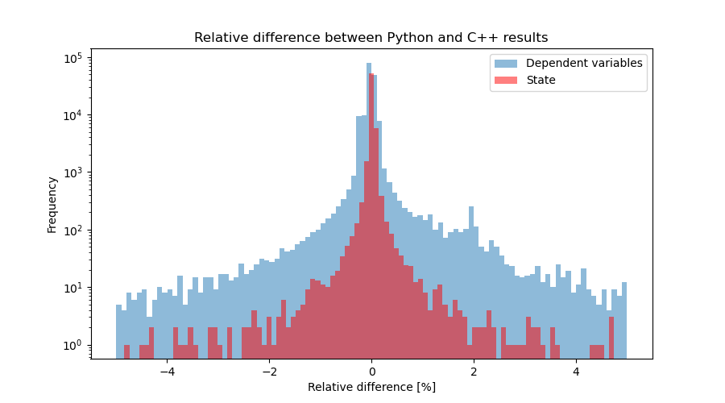

# Perturbed Orbit example

## Run
0. Make sure the correct Conda environment is activated

```bash
conda activate tudat-bundle
```


1. Build the C++ code

```bash
make all
```

2. Run the C++ code

```bash
./build/perturbed-sat
```

3. Run the Python code
```bash
python perturbed-satellite-orbit
```

5. Postprocess the output of the C++ and Python code
```bash
python postprocess.py
```


> **Alternatively**, you can use the `./runAll`, which does all of the steps mentioned above.
{.is-warning}


## Result



